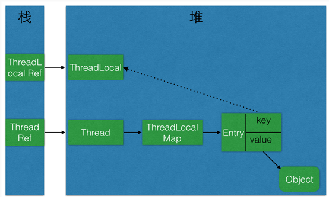

<!-- TOC -->

- [1. ThreadLocal原理和适用场景](#1-threadlocal原理和适用场景)
- [2. Java8](#2-java8)
- [3. JDBC批处理](#3-jdbc批处理)
- [4. 弱引用](#4-弱引用)
- [5. java.util.concurrent包](#5-javautilconcurrent包)
- [6. JAVA实现长连接，含心跳检测](#6-java实现长连接含心跳检测)
- [99. 一些说明](#99-一些说明)

<!-- /TOC -->
# 1. ThreadLocal原理和适用场景
- ThreadLocal 并不解决线程间共享数据的问题
- **ThreadLocal 适用于每个线程需要自己独立的实例，且该实例需要在多个方法中被使用，也即变量在线程间隔离而在方法或类间共享的场景。**

- 原理图
> 
- 实践代码[threadlocal](code/threadlocal)
- [笔记](code/threadlocal/note.md)
- [threadlocal使用场景](code/threadlocal/note.md#5-threadlocal使用场景)

# 2. Java8 
- [代码](code/Java8-lambda)


# 3. JDBC批处理
- [代码](code/jdbc-batch-operate)


# 4. 弱引用
Java中的弱引用具体指的是java.lang.ref.WeakReference<T>类
> 假设垃圾收集器在某个时间点决定一个对象是弱可达的(weakly reachable)（也就是说当前指向它的全都是弱引用），这时垃圾收集器会清除所有指向该对象的弱引用，然后把这个弱可达对象标记为可终结(finalizable)的，这样它随后就会被回收。
- [代码](code/reference)

# 5. java.util.concurrent包
CountDownLatch/CyclicBarrier/Semaphore
- [代码](code/concurrent)

# 6. JAVA实现长连接，含心跳检测
- [代码](code/socket)

# 99. 一些说明
- 用IDEA的md编辑器，在` ```java``` `中的代码片段会报错。
    > 未找到很好的不报错的解决方法。所以在IDEA中编辑md文件时，用\`\`\`jav代替\`\`\`java，等到写好后，再用\`\`\`java替换\`\`\`jav即可。
