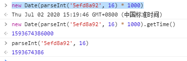

> 如 ObjectId("5efd8a92e4b0e5e520ac7030")
>
> ObjectId组成：共12字节（24个16进制字符），4字节（8字符）时间戳（单位为秒）+5字节*随机值*+3字节*递增计数器*，初始化为随机值		


```js
new Date(parseInt('5efd8a92e4b0e5e520ac7030'.substring(0, 8), 16) * 1000)
```




