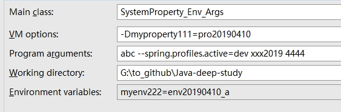

一些疑问的解答
## 1. Java系统属性、环境变量、程序参数
以前一直搞不清楚，这次通过简单几行代码就能搞明白，见`SystemProperty_Env_Args.java`
- 系统参数通过System.getProperty获得，形式为`-Dxxx=xxx`
- 环境变量通过System.getenv获得, path就是环境变量
- 程序参数 即main的形参args，如果是通过java命令运行，形式为`java Main arg1 arg2 argn`或`java -jar a.jar arg1 arg2 argn`
### 设置方式
1. 命令行，如`java -Dmyproperty111=pro20190410 SystemProperty_Env_Args abc --spring.profiles.active=dev xxx2019 4444`  
环境变量在电脑属性设置
2. IDE运行时，设置`Run/Debug Configurations`，如图  

