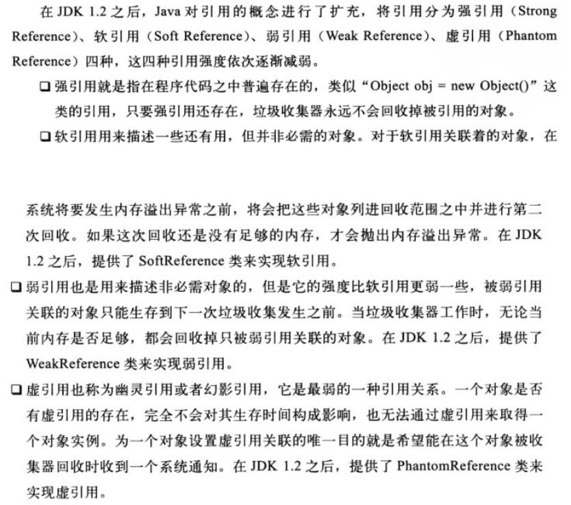

<!-- TOC -->

- [1. 读代码ThreadLocalDemo结论](#1-读代码threadlocaldemo结论)
- [2. ThreadLocal实现](#2-threadlocal实现)
    - [2.1 Thread](#21-thread)
    - [2.2 ThreadLocal](#22-threadlocal)
    - [2.3 ThreadLocal.ThreadLocalMap.Entry](#23-threadlocalthreadlocalmapentry)
- [3. ThreadLocal案例](#3-threadlocal案例)
    - [3.1 一个demo](#31-一个demo)
        - [不使用 ThreadLocal](#不使用-threadlocal)
        - [ThreadLocal实现该功能](#threadlocal实现该功能)
    - [3.2 解决线程安全问题](#32-解决线程安全问题)
- [4. 总结](#4-总结)
- [99. 参考](#99-参考)

<!-- /TOC -->
# 1. 读代码ThreadLocalDemo结论
1. 不同线程都是同一个ThreadLocal变量，因为是类静态变量
2. 不同线程的threadlocal.get()的实例不同
3. threadlocal.set(T)替换当前线程的threadlocal.get()实例

# 2. ThreadLocal实现
## 2.1 Thread
**Thread**类中有一个ThreadLocalMap的实例变量threadLocals，包权限，键是ThreadLocal变量
> java5/java8都是这种实现，即Thread维护ThreadLocal与实例的映射，该方案没有锁的问题，每个线程访问某 ThreadLocal 变量后，都会在自己的 Map 内维护该 ThreadLocal 变量与具体实例的映射
```java
    ThreadLocal.ThreadLocalMap threadLocals = null;
```
> 至于另一种方案ThreadLocal维护线程与实例的映射，增加线程与减少线程均需要写Map，要保证线程安全，需要锁，jdk没有采用这种方案
## 2.2 ThreadLocal
- 在ThreadLocal中，通过Thread.currentThread().threadLocals即可获得ThreadLocalMap实例
> `ThreadLocalMap m = getMap(Thread.currentThread());`
- ThreadLocal.getMap
```java
    ThreadLocalMap getMap(Thread t) {
        return t.threadLocals;
    }
```
- ThreadLocal.get实现如下：
```java
    public T get() {
        Thread t = Thread.currentThread();
        ThreadLocalMap map = getMap(t);
        if (map != null) {
            ThreadLocalMap.Entry e = map.getEntry(this);
            if (e != null) {
                @SuppressWarnings("unchecked")
                T result = (T)e.value;
                return result;
            }
        }
        
        //第一次获取，设置初始值
        return setInitialValue();
    }
```
- ThreadLocal.setInitialValue
```java
    private T setInitialValue() {
        //设置初始值
        T value = initialValue(); 
        Thread t = Thread.currentThread();
        ThreadLocalMap map = getMap(t);
        if (map != null)
            map.set(this, value);
        else
            createMap(t, value);
        return value;
    }
    
```
- ThreadLocal.initialValue，可以重写该方法，指定初始值
```java
    protected T initialValue() {
        return null;
    }
```
- ThreadLocal.set实现如下：
```java
    public void set(T value) {
        Thread t = Thread.currentThread();
        ThreadLocalMap map = getMap(t);
        if (map != null)
            map.set(this, value);
        else
            createMap(t, value);
    }
    
    
```
- ThreadLocal.createMap
```java
//创建ThreadLocalMap，赋值给t.threadLocals
    void createMap(Thread t, T firstValue) {
        t.threadLocals = new ThreadLocalMap(this, firstValue);
    }
```
## 2.3 ThreadLocal.ThreadLocalMap.Entry
```java
  static class Entry extends WeakReference<ThreadLocal<?>> {
      /** The value associated with this ThreadLocal. */
      Object value;

      Entry(ThreadLocal<?> k, Object v) {
          super(k);
          value = v;
      }
  }
```
> Entry对象当中的Key值对TheadLocal的引用就是弱引用.这样当ThreadLocal对象除了Entry对象外没有其他引用的时候，在下一次垃圾回收发生时，该对象将被回收
# 3. ThreadLocal案例
## 3.1 一个demo
###  不使用 ThreadLocal
```java
public class SessionHandler {

  @Data
  public static class Session {
    private String id;
    private String user;
    private String status;
  }

  public Session createSession() {
    return new Session();
  }

  public String getUser(Session session) {
    return session.getUser();
  }

  public String getStatus(Session session) {
    return session.getStatus();
  }

  public void setStatus(Session session, String status) {
    session.setStatus(status);
  }

  public static void main(String[] args) {
    new Thread(() -> {
      SessionHandler handler = new SessionHandler();
      Session session = handler.createSession();
      handler.getStatus(session);
      handler.getUser(session);
      handler.setStatus(session, "close");
      handler.getStatus(session);
    }).start();
  }
}
```
> 该方法是可以实现需求的。但是每个需要使用 Session 的地方，都需要显式传递 Session 对象，方法间耦合度较高。

### ThreadLocal实现该功能
```java
public class SessionHandler {

  public static ThreadLocal<Session> session = new ThreadLocal<Session>();

  @Data
  public static class Session {
    private String id;
    private String user;
    private String status;
  }

  public void createSession() {
    session.set(new Session());
  }

  public String getUser() {
    return session.get().getUser();
  }

  public String getStatus() {
    return session.get().getStatus();
  }

  public void setStatus(String status) {
    session.get().setStatus(status);
  }

  public static void main(String[] args) {
    new Thread(() -> {
      SessionHandler handler = new SessionHandler();
      handler.getStatus();
      handler.getUser();
      handler.setStatus("close");
      handler.getStatus();
    }).start();
  }
}
```
> 可通过在线程内创建局部变量可实现每个线程有自己的实例，使用静态变量可实现变量在方法间的共享。但如果要同时满足变量在线程间的隔离与方法间的共享，ThreadLocal再合适不过。

## 3.2 解决线程安全问题

# 4. 总结
- ThreadLocal 并不解决线程间共享数据的问题
- ThreadLocal 通过隐式的在不同线程内创建独立实例副本避免了实例线程安全的问题
- 每个线程持有一个 Map 并维护了 ThreadLocal 对象与具体实例的映射，该 Map 由于只被持有它的线程访问，故不存在线程安全以及锁的问题
- ThreadLocal 适用于变量在线程间隔离且在方法间共享的场景
> 另外，该场景下，并非必须使用 ThreadLocal ，其它方式完全可以实现同样的效果(可以在线程内部构建一个单独的实例，通过方法间引用传递的形式实现)，只是 ThreadLocal 使得实现更简洁。见[不使用 ThreadLocal](#不使用-threadlocal)
- 防止内存泄漏
  - ThreadLocalMap的key为弱引用
  > 
  - ThreadLocalMap在执行set和rehash方法时，对key为null（即entity.get()==null）的，会将entry的value设置为null，将Entry[]对应元素置为null，size减1

# 99. 参考
- [Java进阶（七）正确理解Thread Local的原理与适用场景](http://www.jasongj.com/java/threadlocal/)
- 


